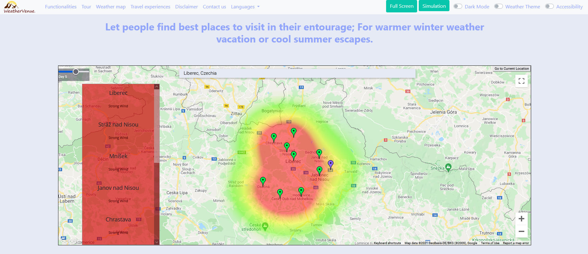
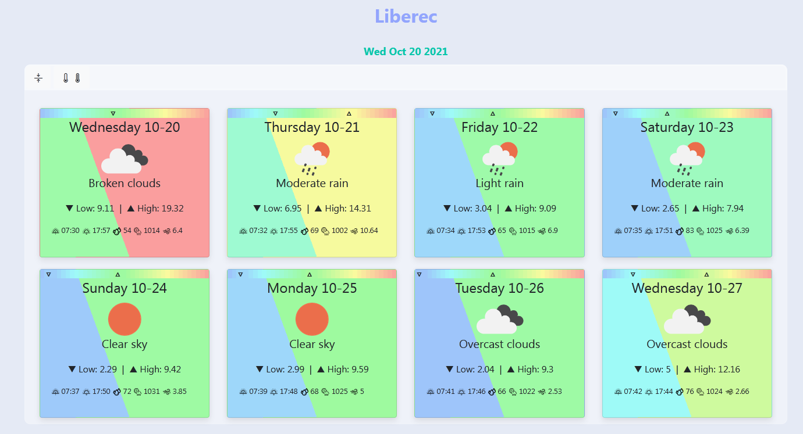
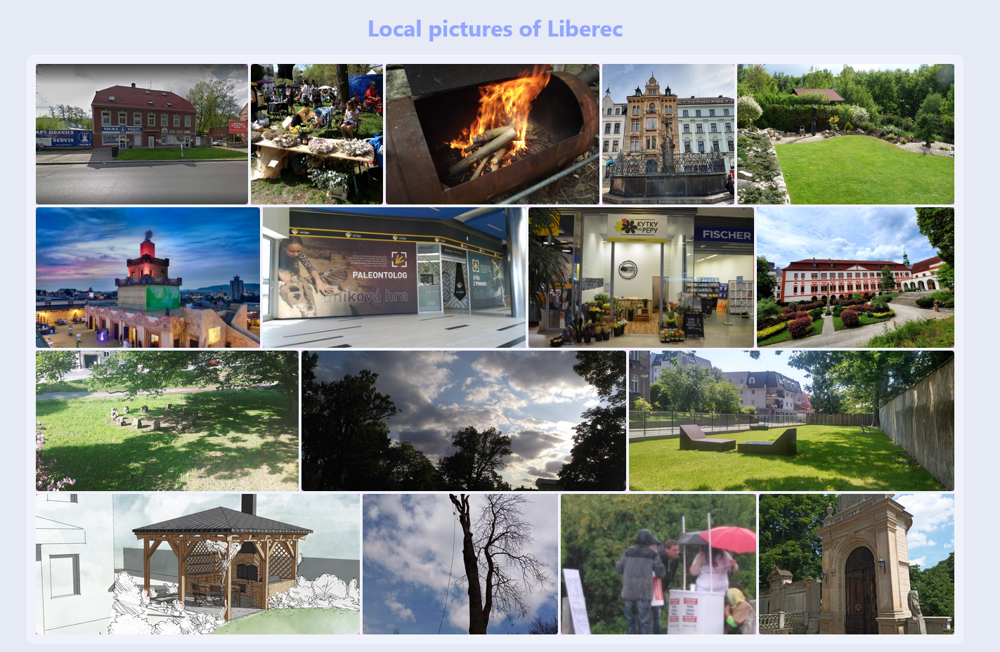

### 🎉Hacktoverfest🎉
# WeatherVenue

> Hacktoberfest: I only accept pull requests where the user went through installation. Please share a capture of a working installation with pull request.
> Also, I do not accept "any" pull request. Something like: Changing a button color would (most probably) be ignored. 

WeatherVenue is a weather website using Google Maps and Openweathermap data to let people find best places to visit in their entourage; For warmer winter weather vacation or cool summer escapes. 

It is a NodeJs & Express web app with other dependencies (axios, redis, reverse-geocode, nearby-cities, openweather-apis...).

# Deployment

[SETUP](https://github.com/bacloud14/WeatherVenue/discussions/33) (this is outdated, now we use Parcel instead of Gulp)

# A Glimpse of UI

when deployed after research it should be like: 

# Contribution

Please see open issues for a specific issue, and do not hesitate to open any new issue (like better code, readability, modularity and best practice, performance, better UI or even functionality enhancements...).

### Current priority: 

https://github.com/bacloud14/WeatherVenue/issues/1

Please know that I am not a keen NodeJS developer, but I successfully made this weather application. It is in its early stage and not proper for final service yet.

If you contribute, please consider that I can merge and publish a new release under one channel or another. It will be 100% free although I can add ads to generate some coffee expenses :)

If you want to maintain the project with me; You can always ask.

Please keep it fair if you want to deploy anywhere; Ask for permission.

Sweet coding !

# License

MIT
